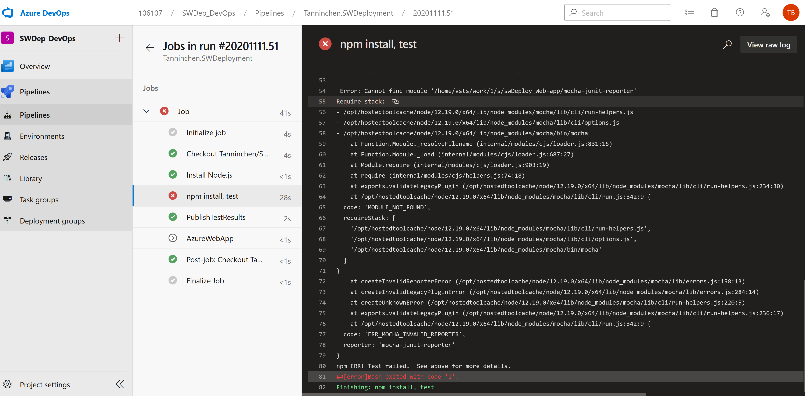
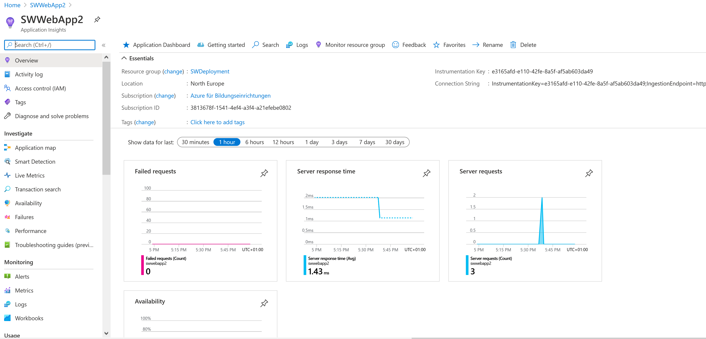

## Link Azure Web App

https://swwebapp2.azurewebsites.net/

## Screenhots zu Deployments

### erfolgreiches Deployement

### nicht erfolgreiches Deployement

## Releases Freigabe:
Für die Release Pipeline wurde das Template 'Azure App Service deployment with continuous monitoring' ausgewählt, danach wurden die Post- und Pre-Conditions eingestellt.
Das Artefact welches vorher produziert wurde, wurde der Release Pipleine hinzugefügt.

## Appilkation Insights:

