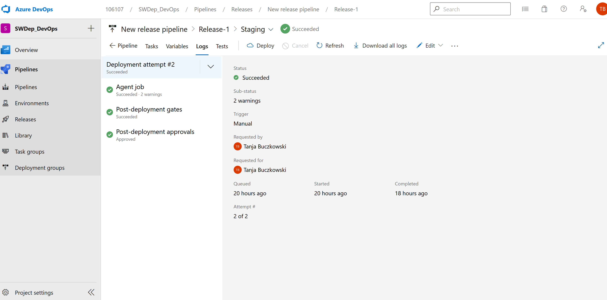
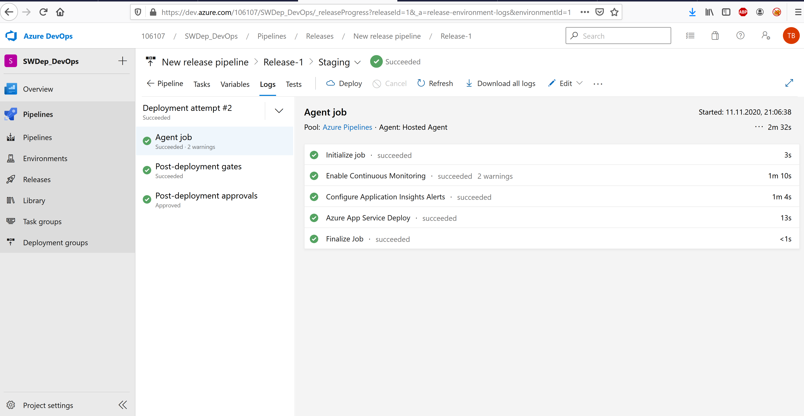
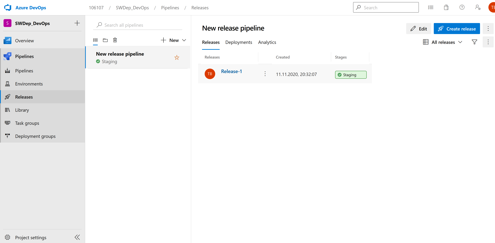

## Link Azure Web App

https://swwebapp2.azurewebsites.net/

### erfolgreiche Deployements

### nicht erfolgreiche Deployements

## Releases Freigabe:
Für die Release Pipeline wurde das Template 'Azure App Service deployment with continuous monitoring' ausgewählt, danach wurden die Post- und Pre-Conditions eingestellt.
Das Artefact welches vorher produziert wurde, wurde der Release Pipleine hinzugefügt.

