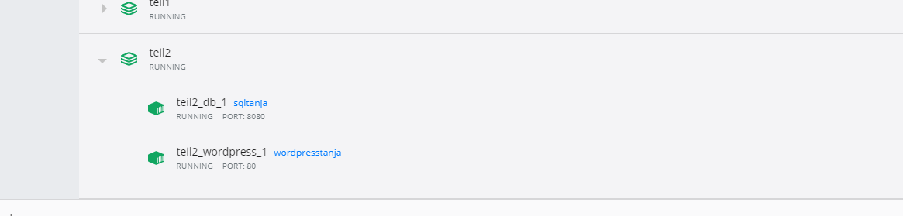

# Teil 1

## Vorgehensweise

docker-compose.yml File erstellen, welches wordPress und eine sepetrate MySQL Instance erstellt, mit Volume um die Daten
persistent halten zu können. 

CMD -> docker-compose up -d 

pulls die benötigten Docker Images & startet wordpress + Datenbank  container 

docker-compose down -> entfernt den container + default network, WordPress DB bleibt aber persistent

docker-compse down --volumes -> entfernt den container, default network & die WordPress DB 

# Teil 2

## Vorgehensweise

### Dockerfile
Für beide Images ein Dockerfile anlegen -> code Dockerfile
Individuelle Befehle in Dockerfile angeben,  docker erstellt Images automatisch beim lesen dieser Befehle
-> alle benötigten Anweisungen in docker-compose.

FROM -> kreiert layer
COPY -> fügt Dateien aus dem aktuellen Verzeichnis des Docker-client hinzu.
RUN -> builds the application
CMD -> gibt an welcher Befehl im Container ausgeführt werden soll.

nur RUN,COPS,ADD erstellen Ebenen. andere Anweisungen erstellen temporäre zwischen Images

### docker-entrypoint.sh
docker-entrypoint.sh -> to initialize stateful data in a container runtime.

sed -> non-interactive textfile editor (Textfilter, d bestimmte ZEichenkombinationen sucht & ersetzt)
    -> einfaches suchen & ersetzten von Zeichenfolgenwerten

sed s/SUCHEN/ERSETZEN/g
sed 's/findme/replacewithme/g' file-to-search.txt > file-to-write-output.txt

### CLI
docker-compose build -t sqltanja . -> to build  custom image
docker-compose build -t wordpresstanja . -> to build  custom image

docker-compose up -d -> to run unser custom image

### Docker Desktop

### Webseite
Wordpress kann nun über https://localhost:80 zugegriffen werden