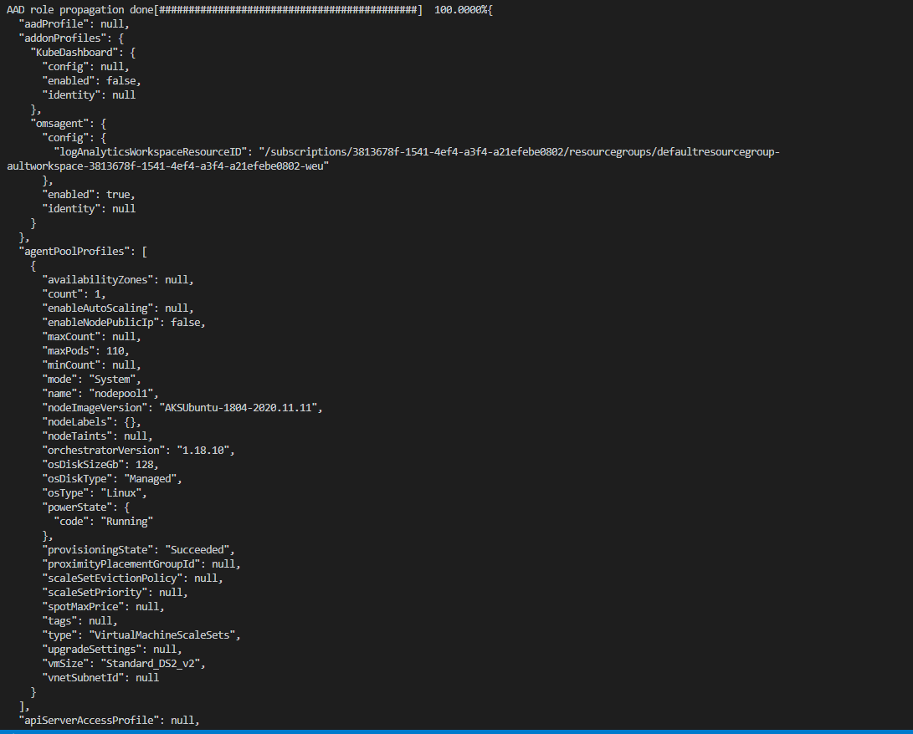
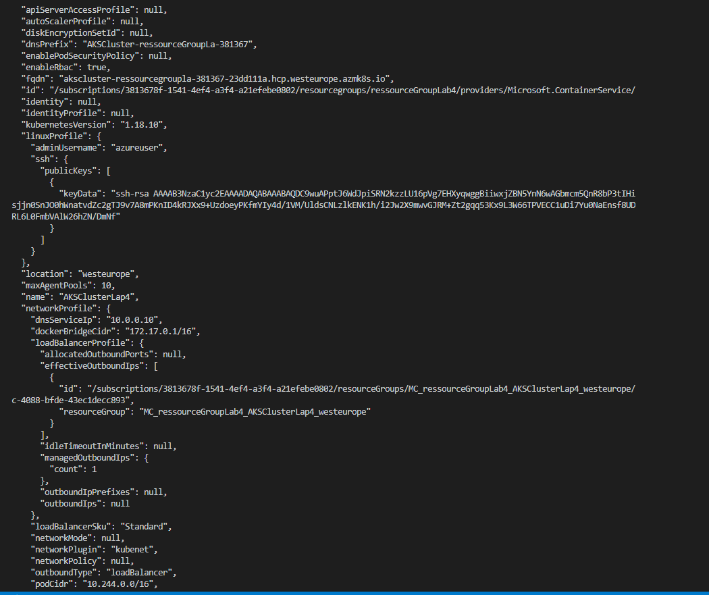
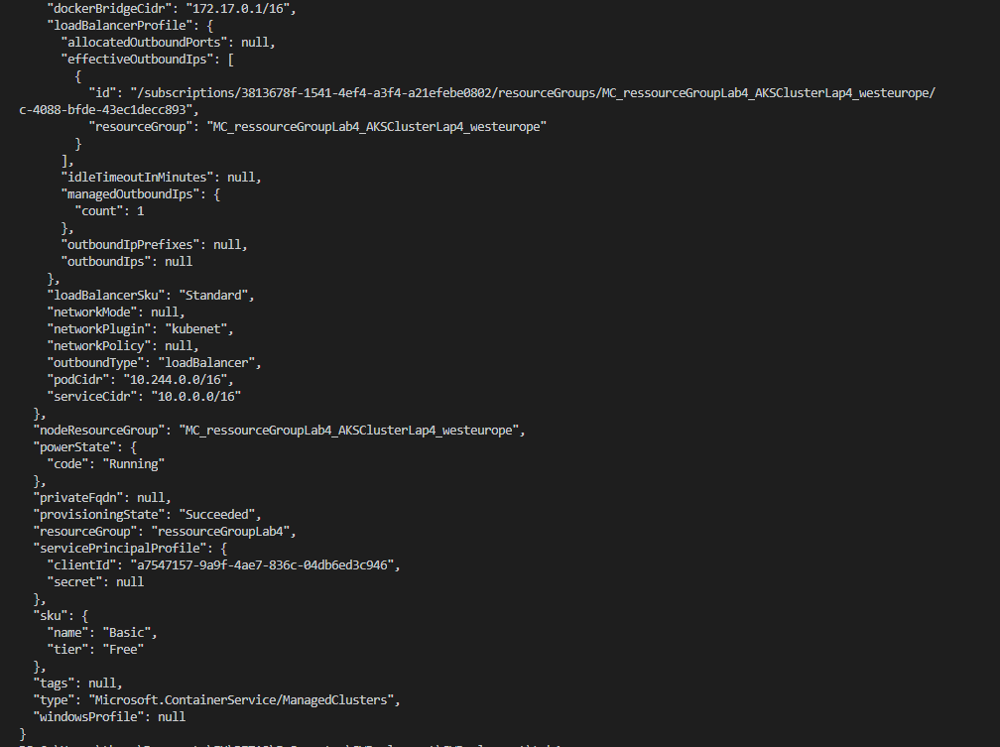
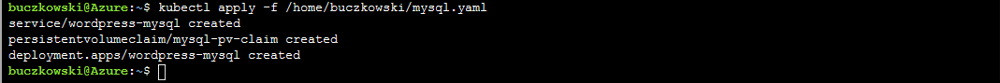
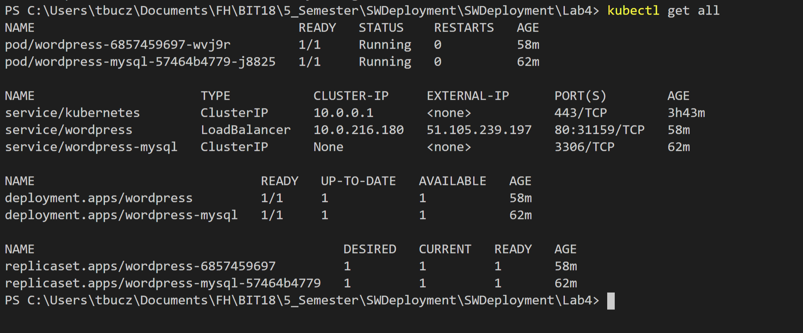
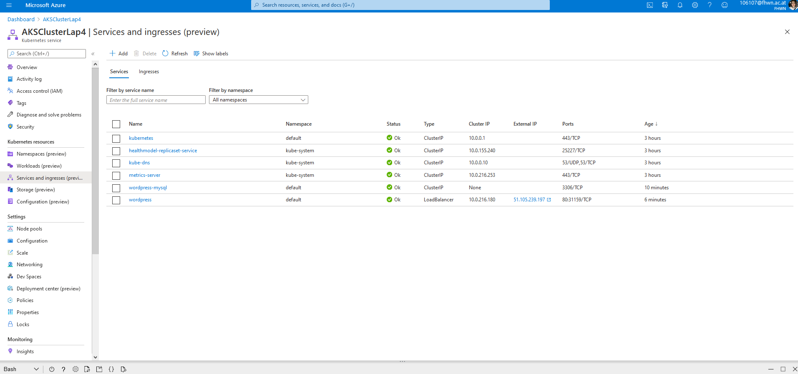

# Ablauf

- Ressource Gruppe anlegen 
    az group create --name ressourceGroupLab4 --location westeurope

- AKS CLuster erstellen
    az aks create --resource-group ressourceGroupLab4 --ing --generate-ssh-keys

- connect to cluster 
    az aks install-cli

- add Credential
    az aks get-credentials --resource-group ressourceGroupLab4 --name AKSClusterLap4

- Yaml Files anlegen

- Password für MySQL DB anlegen -> secret auf K8s Cluster erstellen.
    -> Azure CLI -> kubectl create secret generic mysql-pass --from-literal=password=password123

- Upload mysql & wordpress in Azure clouddrive
- create mySQL Pod and Service 
    kubectl apply -f /home/buczkowski/mysql.yaml

- create wordpress pod and Service
    kubectl apply -f /home/buczkowski/wordpress.yaml

- wordpress ist nun über die 'External-IP' erreichbar http://51.105.239.197/

